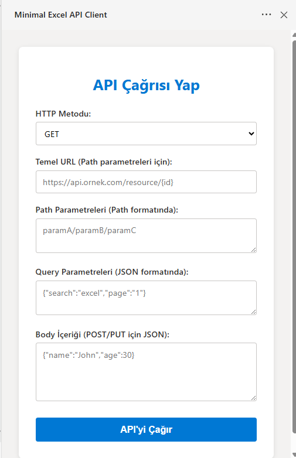
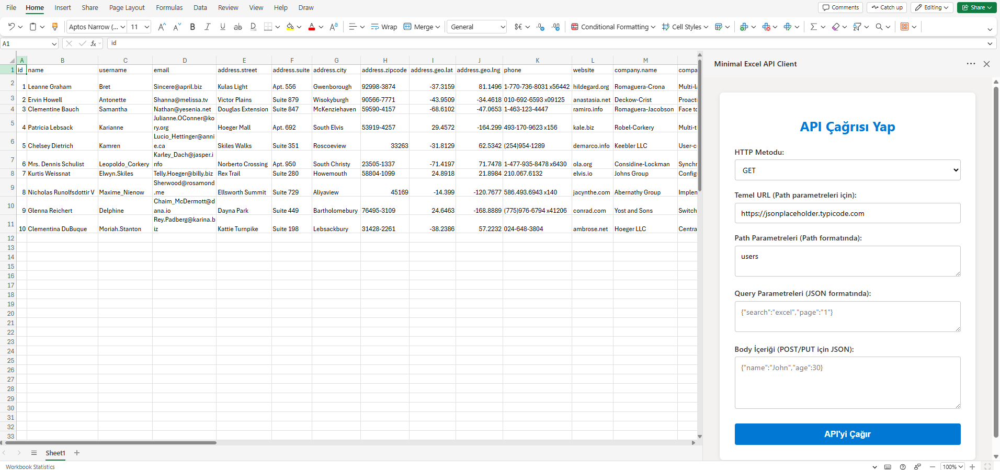

# Excel HTTP Client Web Add-in

This project is a simple HTTP Client Web Add-in for Excel.

---

## Installation / Kurulum

### English

1. Download the latest release from the **Releases** tab:  
   [Go to Releases](https://github.com/javagatech/excel-web-addin/releases)

2. Extract the `.zip` file or directly download the `.xml` manifest file.

3. Open Excel.

4. Go to the **Insert** tab in the ribbon.

5. Click on **Add-ins** or **My Add-ins** on the right side.

6. In the opened window, under **Manage My Add-ins** or **My Add-ins**, click **Upload My Add-in** or **Add a Custom Add-in** at the bottom.

7. Select and upload the `ExcelGetApiClient.xml` file from the extracted folder.

8. The add-in is now ready to use inside Excel!

---

### Türkçe

1. En son sürümü **Releases** sekmesinden indirin:  
   [Releases sayfasına git](https://github.com/javagatech/excel-web-addin/releases)

2. `.zip` dosyasını çıkarın veya direkt `.xml` manifest dosyasını indirin.

3. Excel’i açın.

4. Üst menüden **Ekle (Insert)** sekmesine gidin.

5. Sağ taraftaki **Eklentiler (Add-ins)** veya **Benim Eklentilerim (My Add-ins)** butonuna tıklayın.

6. Açılan pencerede **Eklentilerimi Yönet (Manage My Add-ins)** veya **Benim Eklentilerim** altında, pencerenin altındaki **Eklentimi Yükle (Upload My Add-in)** veya **Özel Eklenti Ekle (Add a Custom Add-in)** seçeneğine tıklayın.

7. Çıkardığınız klasördeki `ExcelGetApiClient.xml` dosyasını seçip yükleyin.

8. Artık Excel’de eklentiniz kullanıma hazır!

---

## Screenshots / Görseller

### Add-in Image / Eklenti Görseli

### Excel Result / Excel İçindeki Sonuç

---

Thank you / Teşekkürler!
